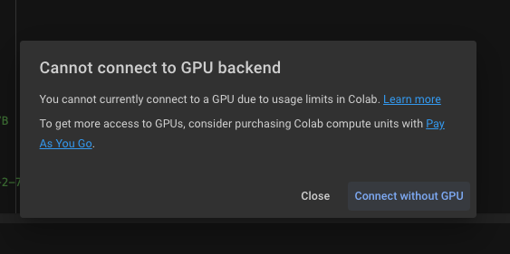

# gemma fine tune notes

Kaggle has 2 t4 available, however there is one library issue causing it fail
Also some how looks like we need to install everything for each session like can we just not restart the session like colab?

Colab same notebook worked. So proabbly unsloth worked there

However I had to limit my dataset rows to be 10000 (for my first run) with reducing batch size from 2 -> 1
Looks like it failed after 30 iterations (whyyyy?)

I would try again with larger data and run it longer. I need atleast 40gb gpu

I have never seen this earlier!!!
GPU shortage is real

